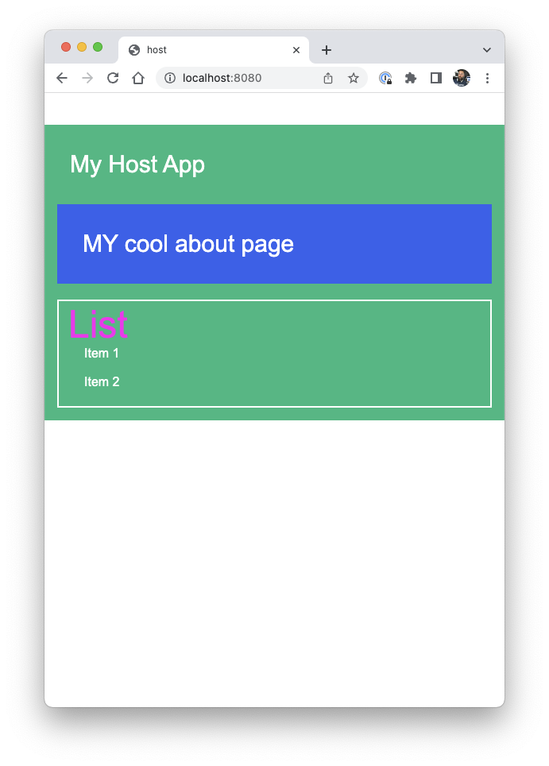
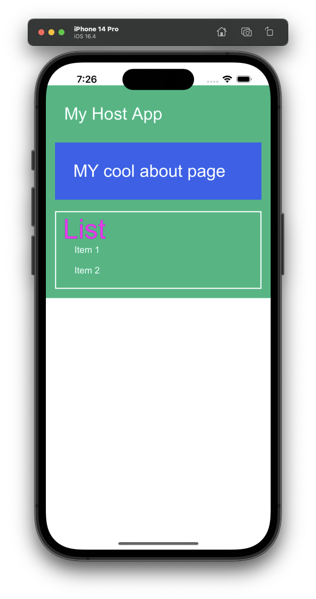

## Federated Capacitor Super App

This project is an example of combining different Micro Frontends with Module Federation into a single app using [Federated Capacitor](https://ionic.io/docs/portals/for-capacitor/overview).

## Disclaimer

You need to have a native key for Federated Capacitor from your Ionic Enterprise account to run this app.

Make sure you add your enterprise key inside the `ionic.config.json` file and log in with the Ionic CLI.

### Testing this example

To test the app, you need to navigate into each folder and run:

```bash
npm run start
```

This will start each MFE on a different port. You should be able to see the main host app running on [http://localhost:8080](http://localhost:8080).


### Running this example

To create a Capacitor app you can run:

```bash
cd ./host
npm run build
npx cap sync
```

This will build all MFEs and combine them in our Capacitor super app!

## Preview
<div style="display: flex; flex-direction: 'row';">


</div>
